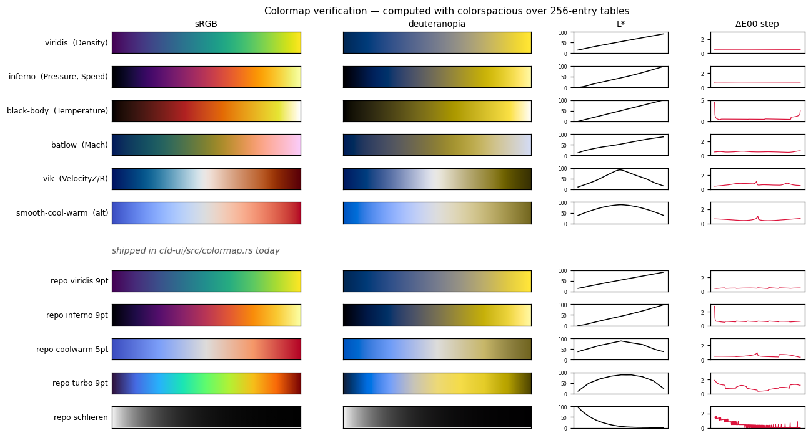

# Colormap style guide

Authority for every colour the field canvas paints. `cfd-ui/src/colormap.rs`
implements this file; if they disagree, this file is wrong or the code is —
resolve it, do not let them drift.

Scope: the eight `FieldKind` LUTs, the wall/NaN/out-of-range colours, the
colorbar, and the range-locking rules. Chrome colours (`BG`, `WALL_COMMITTED`,
`ACCENT`) are session D's, not this document's.

---

## 1. The one rule

**Lightness carries spatial detail. Hue does not.**

The eye resolves fine structure through luminance. A map whose lightness is not
monotonic cannot render a shear layer or a shock cleanly — it invents edges at
hue transitions and flattens real gradients inside a hue band. Kovesi measured
perceptual flat spots in shipped colormaps hiding features up to **one tenth of
the total data range**. Crameri et al. measured non-uniformity injecting **>7%
of the displayed data variation** as pure visual error.

This game shows shocks, Mach diamonds and shear layers. A colormap that hides a
7% variation is showing the player a different flow than the solver computed.
Every rule below follows from this.



*Every preset in this document, plus what `colormap.rs` ships today: sRGB swatch,
deuteranopia simulation, CIELAB L\* profile, and ΔE00 step size between adjacent
LUT entries. A flat red trace is a perceptually uniform map. The sawtooth on
`repo schlieren` is the duplicated-entry collapse described in §5.*

## 2. Field → preset defaults

These are **defaults, not fixed assignments.** Colormap identity is a `Preset`,
independent of `FieldKind`; the player can put any preset on any field from the
Display panel, and that choice is theirs to keep. The table is what the field
starts as and what it returns to, and the rationale below is why — a player
overriding it should be overriding a reasoned position, not an arbitrary one.

The canvas is a **flat 2D image**, not a shaded 3D surface. Nothing else is
using lightness, so we use the full black→white range. That is why the
2D-image family (`inferno`, `black-body`, `vik`) is preferred here over the
bounded-lightness family (`fast`, `smooth-cool-warm`) that ParaView defaults to
for 3D scenes.

| `FieldKind` | Type | Default preset | Centre / range |
|---|---|---|---|
| `Density` | sequential | **`viridis`** | data range, zero-anchored |
| `Pressure` | sequential | **`inferno`** | data range |
| `Temperature` | sequential | **`black-body`** | data range |
| `Mach` | sequential | **`batlow`**, with an explicit **M = 1 sonic isoline** overlay | 0 → max |
| `VelocityZ` | diverging | **`vik`** | symmetric about 0 |
| `VelocityR` | diverging | **`vik`** | symmetric about 0 |
| `Speed` | sequential | **`inferno`** | 0 → max |
| `Schlieren` | neutral | **inverted grayscale** | see §5 |

Rationale for the ones that are not obvious:

- **Density and Pressure must not share a map.** They are correlated but not
  identical, and a player switching between them needs to see that something
  changed. `viridis` / `inferno` are both uniform and instantly distinguishable.
- **Temperature gets `black-body`.** Warm = hot is the one genuinely
  cross-domain semantic convention in field visualisation, and Moreland's map is
  derived from black-body radiation. It is also the map a rocket plume *should*
  look like.
- **Mach is sequential, not diverging.** M = 1 is a real physical threshold, and
  a diverging map pinned there is defensible — but only for a transonic-focused
  view. In a converging-diverging nozzle the interesting range is 0 → 4+, and a
  diverging map spends half its perceptual budget below M = 1 where almost
  nothing happens. Mark the sonic line as a **line**, which is how engineers
  actually read transonic results, and keep the colour budget on the supersonic
  side. This is a deliberate choice, not an industry convention — there is no
  standard for Mach colouring.
- **Signed velocities get a diverging map** because they are signed. This is
  arithmetic, not taste: an asymmetric range on `VelocityR` makes a recirculation
  look stronger on one side than the other. `lock_range` already enforces the
  symmetry — keep it.

**Not used, deliberately:** `jet`, `hsv`, any hand-rolled rainbow. See §7.

### What the player can change

Three controls in the Display panel, all per field.

**The picker.** Every preset is offered for every field. The list is *not*
filtered by `PresetKind` — a diverging map on `Mach` centred at 1.0 is a
legitimate transonic view, and a filter that silently removed it would be
wrong more often than the mistake it prevents. Guidance is carried by a weak
inline warning instead: selecting a diverging preset for a field that is not
signed says so, because the light band then lands wherever the range happens to
put it and reads as a feature that is not there. Warn, never prevent.

**The guardrail toggle ("free range").** §8's range rules — Schlieren pinned to
[0, 1], signed fields symmetric about zero — are enforced by default, and
editing one end of a signed field's range moves the other to match. The toggle
suspends them for that field and names what is no longer enforced, e.g.
*asymmetric — zero is off the colormap's light point*. It appears only on the
fields that have a rule to suspend. Turning it back off re-imposes the rule
immediately; leaving an asymmetric range under a toggle that claims symmetry
would make the control a lie.

**Auto vs manual ranges.** A range is *auto* while `lock_range` owns it and
becomes *manual* the moment it is typed or dragged. The distinction only matters
at the re-lock that follows a rebuild: auto ranges are overwritten with the new
scales, manual ones are left exactly as the player set them and flagged
*scales changed — range may be stale*, cleared by Refit or by any further edit.

The flag is the whole point. A p₀ change can move the reference scales by 35×,
so a range chosen against the old ones can render as a solid block of one
colour. Discarding what the player typed loses their work; showing them the
solid block with no explanation loses their trust. Flagging is the only option
that loses neither.

Edits are **rejected, not clamped**: a non-finite entry or an inverted range
reverts to the last committed value and highlights the offending end. A silently
clamped range misreports what was asked for, which is the same class of error as
a silently rescaling colorbar.

## 3. Preset control points

Positions are normalised 0→1 and are **not evenly spaced**. Each set is the
*minimal* number of anchors that reproduces the reference map to
**max ΔE00 ≤ 2.0** (about one just-noticeable difference) under
`colormap.rs`'s piecewise-linear-in-sRGB `build()` — including `build()`'s
rounding of every entry to `u8`, which the tool models, so the figure quoted
here is the one the shipped LUT actually measures. Copy them exactly.
Regenerate rather than hand-edit — `docs/tools/verify_colormap.py` emits these
tables:

```
pip install colorspacious cmcrameri
python docs/tools/verify_colormap.py viridis
python docs/tools/verify_colormap.py cmc.vik --kind diverging
python docs/tools/verify_colormap.py --diverging 59,76,192 180,4,38
```

### `viridis` — Density
7 anchors · max ΔE00 1.69 · L\* 14.9→90.9 · step CV 1.2%

| pos | rgb |
|---|---|
| 0.0000 | 68, 1, 84 |
| 0.1765 | 67, 61, 132 |
| 0.4196 | 40, 125, 142 |
| 0.5882 | 33, 165, 133 |
| 0.7098 | 72, 193, 110 |
| 0.8863 | 178, 221, 45 |
| 1.0000 | 253, 231, 37 |

### `inferno` — Pressure, Speed
12 anchors · max ΔE00 1.96 · L\* 0.1→97.9 · step CV 1.1%

| pos | rgb |
|---|---|
| 0.0000 | 0, 0, 4 |
| 0.0667 | 12, 8, 38 |
| 0.1176 | 30, 12, 69 |
| 0.1686 | 52, 10, 95 |
| 0.2980 | 106, 23, 110 |
| 0.4275 | 159, 42, 99 |
| 0.5922 | 218, 78, 60 |
| 0.7255 | 247, 130, 18 |
| 0.8157 | 252, 172, 17 |
| 0.9020 | 246, 215, 70 |
| 0.9569 | 241, 241, 121 |
| 1.0000 | 252, 255, 164 |

### `black-body` — Temperature
7 anchors · max ΔE00 1.94 (**float fit, not re-measured** — see below) ·
L\* 0.0→100.0 · linear in L\*

| pos | rgb |
|---|---|
| 0.0000 | 0, 0, 0 |
| 0.0235 | 18, 6, 3 |
| 0.0745 | 38, 16, 10 |
| 0.3922 | 178, 34, 34 |
| 0.5843 | 227, 105, 5 |
| 0.8863 | 230, 229, 53 |
| 1.0000 | 255, 255, 255 |

Note: `black-body` measures a step CV of 59% and peak/mean 7.4. That is not a
defect — the map is designed for *linear L\**, not constant ΔE00, and the
spikes sit at the near-black end where 8-bit quantisation dominates. Accepted
tradeoff for the heat semantics.

**Outstanding:** every other table on this page was re-fitted after
`verify_colormap.py` was corrected to round each LUT entry to `u8` the way
`build()` does. `black-body` was not, because its reference map is not
reproducible from the tool — it is neither a matplotlib nor a `cmcrameri` name,
and no anchor CSV for it is checked in. Its 1.94 is therefore the old float-fit
figure and the shipped LUT is likely a little above it, by the same ~0.1–0.2
the other maps moved. The table itself is unchanged and in use. Closing this
means checking in the source table it was fitted from, then re-running the tool.

### `batlow` — Mach
9 anchors · max ΔE00 1.23 · L\* 12.2→87.2 · step CV 8.9%

| pos | rgb |
|---|---|
| 0.0000 | 1, 25, 89 |
| 0.1255 | 17, 67, 96 |
| 0.2706 | 39, 99, 95 |
| 0.4392 | 103, 123, 62 |
| 0.5569 | 157, 137, 43 |
| 0.6627 | 209, 147, 66 |
| 0.7529 | 242, 157, 109 |
| 0.8196 | 252, 169, 149 |
| 1.0000 | 250, 204, 250 |

### `vik` — VelocityZ, VelocityR
9 anchors · max ΔE00 1.72 · L\* 11.2→91.6 (apex at 0.49)→16.3 · step CV 17.6%

| pos | rgb |
|---|---|
| 0.0000 | 0, 18, 97 |
| 0.1765 | 8, 89, 143 |
| 0.2588 | 54, 129, 169 |
| 0.4314 | 192, 216, 228 |
| 0.4863 | 231, 231, 231 |
| 0.5647 | 233, 202, 184 |
| 0.8118 | 179, 83, 31 |
| 0.8784 | 145, 45, 6 |
| 1.0000 | 89, 0, 8 |

The anchor at **0.4863** is not decoration. It is the light apex; drop it and
the lightness derivative flips sign discontinuously and the eye reads a hard
edge at exactly `u = 0` — a shear layer that is not there. See §4.

### Alternate diverging: `smooth-cool-warm`
Keep available as a settings option for players who expect ParaView's classic
blue-white-red. 10 anchors · max ΔE00 1.47 · step CV 19.2%.

| pos | rgb |
|---|---|
| 0.0000 | 59, 76, 192 |
| 0.1451 | 105, 138, 239 |
| 0.2627 | 146, 180, 254 |
| 0.3804 | 186, 209, 248 |
| 0.4980 | 220, 221, 221 |
| 0.6275 | 245, 196, 172 |
| 0.7490 | 244, 154, 123 |
| 0.8941 | 216, 86, 70 |
| 0.9490 | 199, 54, 52 |
| 1.0000 | 180, 4, 38 |

### Rainbow option: `turbo`
Not the default for any field (§7); shipped so the "Turbo (classic)" picker
entry is real turbo rather than a resample of it. 12 anchors · max ΔE00 1.99 ·
1 L\* reversal · deuteranopia min step 0.081.

| pos | rgb |
|---|---|
| 0.0000 | 48, 18, 59 |
| 0.0863 | 68, 81, 191 |
| 0.1882 | 66, 148, 255 |
| 0.2471 | 42, 185, 238 |
| 0.3373 | 28, 230, 180 |
| 0.4706 | 139, 255, 75 |
| 0.5451 | 193, 243, 52 |
| 0.6353 | 241, 203, 58 |
| 0.6980 | 254, 167, 50 |
| 0.7686 | 248, 114, 28 |
| 0.8706 | 212, 51, 5 |
| 1.0000 | 122, 4, 3 |

The CVD and step-CV numbers here fail the §10 gate on purpose — that is what
§7 means by "conditional". They are recorded so the cost of choosing it is
visible, not so it can be presented as an equal option.

## 4. Why the old LUTs were wrong

**Closed.** `colormap.rs` now builds every preset from the §3 tables. This
section is kept because the measurements are the reason the tables look the way
they do — anyone tempted to "tidy" the anchor positions into even spacing is
about to reintroduce exactly this.

Measured against the true reference maps, over 256 entries, max ΔE00 in
CAM02-UCS. These are the numbers that justified changing `colormap.rs`. They
predate the `u8`-rounding correction to the tool and so understate the error
slightly — re-measured, turbo is 21.78 and coolwarm 6.61. The verdicts do not
move.

| superseded LUT | max ΔE00 vs reference | verdict |
|---|---|---|
| 9 even-spaced viridis anchors | **1.10** | fine — keep the map, use the 7-anchor table anyway (fewer points, same fidelity) |
| 9 even-spaced inferno anchors | **3.14** | marginal; visible as a soft false band in the smooth plume |
| 5 even-spaced coolwarm anchors | **6.50** | **wrong**; L\* apex is a sharp corner, producing a Mach band at `u = 0` |
| 9 even-spaced turbo anchors | **21.64** | **this is not turbo.** 3 lightness reversals vs turbo's 1 |

The root cause is the same in all four: **evenly-spaced resampling of a
non-linear curve**. `build()` interpolates linearly in sRGB between anchors,
which is fine, but the anchors have to be placed where the curve bends. Nine
evenly-spaced points happen to land well on viridis and badly on turbo.

The coolwarm case is the one Moreland's whole paper is about: a blue→white→red
path interpolated piecewise-linearly cannot round off at the white point, so
lightness transitions discontinuously from rising to falling and the eye reads
an edge. Msh interpolation exists to level that off. Either use the 10-anchor
table above (which samples the Msh path densely enough near the apex) or bake
the Msh curve offline. Do not hand-place three points and hope.

**Do not "fix" this by adding more evenly-spaced anchors.** Use the non-uniform
tables in §3, which hit ΔE00 ≤ 2.0 with the same or fewer points.

## 5. Schlieren

The convention here is real and reproducible, after Quirk (1994):

```
|∇ρ| = sqrt((∂ρ/∂z)² + (∂ρ/∂r)²)
S    = (|∇ρ| - min) / (max - min)          normalised per frame
Sch  = exp(-k · S)                          k ≈ 5, the contrast knob
```

Plotted in greyscale, **inverted**: strong gradient → dark, on a light ground,
so shocks read as the dark bands you see in a real schlieren photograph. The
exponential is dynamic-range compression — a linear grayscale of `|∇ρ|` shows
only the strongest shock and loses every weak wave in the plume.

`lock_range` already pins Schlieren to `[0, 1]`; keep that.

### The current implementation wastes half the LUT

`colormap.rs` folds the exponential into the **LUT values**:
`shade = 245 * exp(-5x)`, indexed uniformly in `x`. Measured consequence: the
256-entry table contains only **131 distinct grey levels** — 125 of the 256
entries are exact duplicates of their neighbour.

The loss is not evenly spread. `d(shade)/dk = -4.8·exp(-5x)` per LUT step:

- At the **weak-gradient end** (`x → 0`) adjacent entries jump ~5 code values.
  That is visible banding in the smooth plume background — and a player reads
  those bands as waves.
- At the **strong-gradient end** (`x → 1`) the table collapses. The top quarter
  of the range — indices 192-255, i.e. every shock strong enough to matter —
  resolves to **5 distinct greys**, with one run of 21 consecutive entries
  painting the identical value. A strong shock and a very strong shock are the
  same pixel.

Both ends are wrong, and adding LUT entries does not help: the problem is the
*index mapping*, not the table length.

**Root-cause fix.** Apply `exp(-k·S)` to the scalar in the snapshot pass in
`cfd-core`, and make the UI LUT a plain grey ramp using all 256 levels. Three
things fall out:

1. Every LUT entry becomes distinct — no banding, no collapse.
2. `k` becomes a real contrast slider instead of a compile-time constant.
3. It is **cheaper**, not more expensive. The comment in `colormap.rs` is right
   that a per-pixel `exp()` costs 0.5 → 2.1 ms, but the display texture is up to
   2048×1024 (2.1 M texels) while the grid is order 400×200 (80 k cells) — the
   exponential in the snapshot runs ~26× fewer times than it would per pixel.
   The per-pixel path stays a pure LUT index either way.

Until that lands, at minimum round instead of truncating: a bare `as u8` on
`245.0 * exp(...)` biases every level down by up to one code. **Done** — the
`grayscale` preset rounds. The root-cause fix is still open: it crosses into
`cfd-core`, so it stays a separate work order.

## 6. Wall, NaN, and out-of-range

Silent clamping is how a correct solver produces a lying image. The player has
to be able to see that data is being clipped.

| role | colour | requirement |
|---|---|---|
| solid / wall | `72, 74, 82` (current `SOLID_RGBA`) | min ΔE00 to any LUT entry **> 20** |
| NaN / non-finite | **`255, 0, 255`** magenta | same |
| below range | darkened endpoint, distinct | opt-in, visible |
| above range | brightened endpoint, distinct | opt-in, visible |

Measured minimum ΔE00 from the current wall grey to every entry of each preset
in §3: viridis 17.4, inferno 24.9, black-body 25.6, batlow 14.0, vik 19.8.
**`batlow` at 14.0 and `viridis` at 17.4 are under the threshold** — on the
Mach and Density views the wall is closer in colour to some field values than
is comfortable. Fix by darkening the wall (a `40, 42, 50` slate measures 15.4
against batlow — no better) or, better, by keeping the existing 1 px wall
outline stroke, which carries the boundary regardless of fill contrast.

Magenta `#FF00FF` clears the threshold against every preset here — worst case
22.3. Mid-grey `#808080` does **not** (2.7 against cividis, 0.0 against a grey
ramp): never use a neutral as a sentinel colour.

NaN handling in the fill loop must be explicit. `is_nan()` is fine in Rust, but
the range test alone catches it:

```rust
let v = src[iz];
if !(v >= lo && v <= hi) { /* NaN, below, or above — branch here */ }
```

A raw `((v - lo) * inv).clamp(0.0, 255.0) as usize` maps NaN to 0 and paints it
as the minimum. That is the current behaviour and it is a silent lie.

## 7. Rainbow

The position is not "rainbow is banned."

- **`jet`, `hsv`, any hand-rolled rainbow: never.** Non-monotonic lightness, no
  perceived ordering, red-green ambiguity. Borland & Taylor 2007 settled this.
- **`turbo`: conditional.** It is an engineered rainbow — banding and CVD
  ambiguity reduced, roughly double viridis's lightness slope so small changes
  pop. Ware, Stone & Szafir (2023) found rainbow genuinely wins at
  *value-lookup-against-a-legend*, which is a real task in this game ("what's
  the Mach number right there?"). It loses badly at *shape perception*, which is
  the more important task here, and it measures worst-in-class on colour
  deficiency (deuteranopia minimum step 0.081 — adjacent values merge for ~5% of
  men).

So: **not the default for any field.** A settings toggle labelled
"Classic (rainbow)" is a legitimate affordance for players trained on Fluent and
EnSight, both of which still ship rainbow defaults. If we ship it, ship real
turbo from the 12-anchor table in §3, not the 9-point resample that is 21.6 ΔE00 away
from it.

Note for credibility with the target audience: ParaView moved off rainbow
long ago and off Cool-to-Warm in 5.13 (default is now `fast`). Ansys has not
moved. Shipping perceptually uniform defaults is the side of that argument that
ages well.

## 8. Colorbar and range

- **Symmetric limits on every diverging field.** `lock_range` does this for
  `is_signed()` fields. Do not add a diverging map for a field that is not
  signed without also giving it a meaningful centre.
- **Tick on the meaningful value** — 0 for signed velocity, 1.0 for Mach. An
  unlabelled centre on a diverging map defeats the point of using one. Break
  even tick spacing to get it.
- **Never auto-rescale during playback.** Per-frame autoscaling is the single
  most common way a correct simulation produces a lying animation: a decaying
  starting vortex never appears to decay because every frame renormalises to its
  own maximum. When the sim is running, lock the range to the steady-state
  estimate or to a player-set custom range; only rescale on an explicit action.
- **Clip at percentiles, not at the singular cell.** One bad corner cell at a
  stagnation point sets `max` and flattens the entire rest of the image. Clip at
  ~1st/99th percentile and paint the out-of-range colours so the clipping is
  visible.
- Always show the variable name and units. `FieldKind::label()` already carries
  them — keep it that way.

## 9. Rendering notes

- LUT stays **256 × RGBA8**. The `k = ((v - lo) * inv).clamp(0, 255)` index path
  is correct and fast; keep the per-pixel work to one clamp and one index.
- egui uploads the texture as plain sRGB bytes and the canvas is unlit, so
  interpolating the sRGB-encoded values is the **right** behaviour here — it
  preserves the perceptual uniformity the map authors designed in. Do not add an
  sRGB→linear decode. (This changes the moment anything lights the canvas.)
- `TextureOptions` must clamp, never wrap. A wrap on the field texture puts the
  maximum next to the minimum at the domain edge — a fake shock at the boundary.
- If banding appears on smooth fields at large window sizes, the fix is
  interleaved-gradient-noise dither at ±0.5/255 in output space, keyed on
  physical pixels — not a bigger LUT. 8-bit banding reads as contour lines to an
  engineer, which is a correctness problem, not a cosmetic one.

## 10. Changing this file

Same rule as the rest of `docs/`: the document is the authority. A colormap
change lands as one commit touching this file and `cfd-ui/src/colormap.rs`
together. Any new or hand-edited preset must be run through
`docs/tools/verify_colormap.py` and must clear:

- L\* monotonic with 0 reversals (sequential), or exactly 1 reversal at the
  centre (diverging)
- ΔE00 step CV under ~15%, or a documented reason why not (see `black-body`)
- peak/mean step under ~2
- deuteranopia minimum step above 0.1
- anchor set reproducing the reference to max ΔE00 ≤ 2.0

Paste the measured numbers into the preset's line in §3. Numbers that only live
in a chat transcript are lost.

---

## Sources

Moreland, *Diverging Color Maps for Scientific Visualization* ([expanded PDF](https://www.kennethmoreland.com/color-maps/ColorMapsExpanded.pdf)) and [Color Map Advice](https://www.kennethmoreland.com/color-advice/) ·
Samsel, Scott, Moreland & Rhyne, *A New Default Colormap for ParaView*, IEEE CG&A 44(4), 2024 ·
Borland & Taylor, *Rainbow Color Map (Still) Considered Harmful*, IEEE CG&A 27(2), 2007 ·
Crameri, Shephard & Heron, *The misuse of colour in science communication*, Nat. Commun. 11:5444, 2020 ·
Crameri, [Scientific Colour Maps v8.0.1](https://www.fabiocrameri.ch/colourmaps/) ·
Kovesi, *Good Colour Maps: How to Design Them*, arXiv:1509.03700 ·
Ware, Stone & Szafir, *Rainbow Colormaps Are Not All Bad*, IEEE CG&A, 2023 ·
Thyng et al., *True Colors of Oceanography*, Oceanography 29(3), 2016 ·
Quirk, *A contribution to the great Riemann solver debate*, IJNMF 18, 1994 (numerical schlieren) ·
[Kitware — new ParaView default colormap](https://www.kitware.com/new-default-colormap-and-background-in-next-paraview-release/).

All ΔE00, L\* and CVD figures in this document were computed with
`colorspacious` over 256-entry tables in CAM02-UCS, not quoted from any source.
